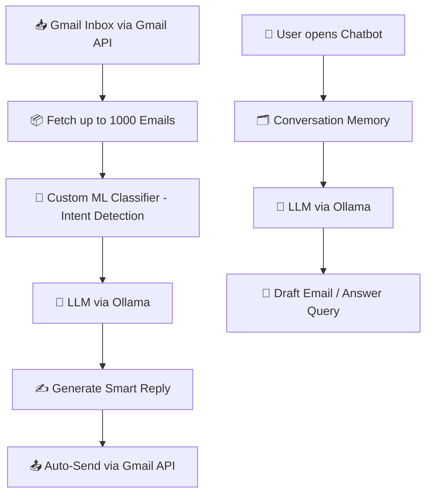

<div align="center">

# 📧 AI Auto Email Reply System & Chatbot

### Read emails, understand intent, and generate smart replies — powered by an open-source LLM

[](https://www.linkedin.com/feed/update/urn:li:activity:7436651484332605440/)
[](https://github.com/vishvasmetaliya07/Mailx_Auto_Emails_Replyi_System)


**🎓 Final Year BCA Project**

</div>

---

## 📖 Overview

**AI Auto Email Reply System & Chatbot** is an AI-powered automation tool that connects to **Gmail via the Gmail API**, reads incoming emails, classifies their intent using a **custom-trained ML classifier**, and generates intelligent, context-aware replies automatically.

Alongside the automation pipeline, the project includes a **chatbot with memory** — letting users draft emails conversationally, ask questions about past conversations, and get contextual responses that carry over previous interactions.

It's built on an **open-source, locally-run LLM (Ollama)**, demonstrating how Machine Learning, NLP, and Generative AI can automate everyday communication workflows without depending on a paid API. This project was built as a **Final Year BCA capstone project**.

---

## 🔗 Links

| | |
|---|---|
| 💻 **Source Code** | [GitHub Repository](https://github.com/vishvasmetaliya07/Mailx_Auto_Emails_Replyi_System) |
| 🎥 **Demo Video** | [Watch on LinkedIn](https://www.linkedin.com/feed/update/urn:li:activity:7436651484332605440/) |

---

## ⚙️ Key Features

- ✅ Connects directly to Gmail via the **Gmail API**
- ✅ Automatically reads incoming emails
- ✅ Detects email intent using a **custom-trained ML classifier**
- ✅ Generates intelligent, AI-based replies
- ✅ **Bulk auto-reply** — processes and responds to up to **1000 emails in a single run**
- ✅ Chatbot interface to draft and write emails on demand
- ✅ Conversation memory for contextual, multi-turn responses
- ✅ Runs fully on a local, open-source LLM via Ollama
- ✅ End-to-end automated email response workflow

---

## 🛠 Tech Stack

| Layer | Technology |
|---|---|
| Language | Python |
| Email Integration | Gmail API |
| Intent Detection | Custom-trained ML classifier |
| Orchestration | LangChain |
| LLM Runtime | Ollama (open-source LLM) |
| Core Techniques | Machine Learning, Deep Learning, NLP, Generative AI |

---

## 🧩 How It Works



---

## 📁 Project Structure

```text
ai-email-reply-system/
│
├── app.py                # Main application / chatbot entry point
├── gmail_client.py       # Gmail API authentication & email fetch/send
├── intent_classifier.py  # Custom-trained ML classifier for intent detection
├── reply_generator.py    # LLM-based reply generation (LangChain + Ollama)
├── memory.py             # Conversation memory management
├── requirements.txt
└── README.md
```

> Update this section to match your actual file structure.

---

## ⚙️ Installation

```bash
# 1. Clone the repository
git clone https://github.com/vishvasmetaliya07/Mailx_Auto_Emails_Replyi_System.git
cd Mailx_Auto_Emails_Replyi_System

# 2. Create and activate a virtual environment
python -m venv venv

# Windows
venv\Scripts\activate

# Linux / macOS
source venv/bin/activate

# 3. Install dependencies
pip install -r requirements.txt

# 4. Pull and run your Ollama model
ollama pull llama3
ollama serve
```

Run the application:

```bash
python app.py
```

---

## 💡 Why This Project

Repetitive email communication eats into productive time. This project explores how a custom ML classifier paired with an open-source LLM can take over routine replies at scale — handling up to 1000 emails per run via the Gmail API — freeing people up for higher-value work, all without depending on a paid API.

---

## 🔮 Roadmap

- [ ] Multi-account Gmail support
- [ ] Reply tone customization (formal / casual)
- [ ] Improve classifier accuracy with more labeled training data
- [ ] Web-based dashboard for review before send
- [ ] Support for additional open-source LLMs

---

## 🤝 Contributing

Contributions are welcome!

```bash
# 1. Fork the repository
# 2. Create a feature branch
git checkout -b feature-name

# 3. Commit your changes
git commit -m "Added new feature"

# 4. Push and open a Pull Request
git push origin feature-name
```

---

## 👨‍💻 Author

<div align="center">

### Vishvas Metaliya

[](https://github.com/vishvasmetaliya07)
[](https://www.linkedin.com/in/vishvas-metaliya/)

</div>

---

<div align="center">

### ⭐ If you found this project useful, consider giving it a star.

**Built with Python • LangChain • Ollama • NLP • Generative AI**

</div>
